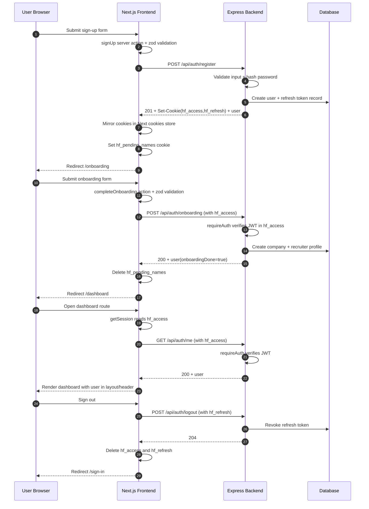

# Auth Flow: Frontend to Backend

This document explains the current authentication flow across the Next.js frontend and Express backend, and how auth-related state is managed in the frontend.

## Stack and Entry Points

- Frontend: Next.js App Router with Server Actions
- Backend: Express API mounted at `/api/auth`
- API base URL in frontend: `NEXT_PUBLIC_API_URL` (default `http://localhost:4000`)
- Cookie names:
  - `hf_access` (15 minutes)
  - `hf_refresh` (7 days)

## High-Level Flow

## Endpoint Contract (Current)

- `POST /api/auth/register`
  - Input: email, password, firstName, lastName
  - Output: user + auth cookies
- `POST /api/auth/login`
  - Input: email, password
  - Output: user + auth cookies
- `POST /api/auth/onboarding` (protected)
  - Input: company and profile fields
  - Output: updated user
- `GET /api/auth/me` (protected)
  - Input: `hf_access` cookie
  - Output: authenticated user
- `POST /api/auth/refresh`
  - Input: `hf_refresh` cookie
  - Output: new access token cookie
- `POST /api/auth/logout`
  - Input: `hf_refresh` cookie
  - Output: refresh revoked + cookies cleared

## Frontend State Management

The frontend uses a layered state model instead of a single global auth store.

### 1) Form/UI State (Client Components)

Managed with `useActionState` in client forms:

- `SignInForm`
- `SignUpForm`
- `OnboardingForm`

What lives here:

- Pending state (`pending`) for loading buttons
- Validation errors (`state.errors`) from server action zod validation
- API-level message (`state.message`) for auth failures

This state is ephemeral and scoped to each form render.

### 2) Session/Auth State (Server Side via Cookies)

Managed in Next.js server runtime, not in localStorage.

- Cookies are read/written in server actions and server components.
- `hf_access` and `hf_refresh` are httpOnly cookies.
- `getSession()` reads `hf_access` and calls backend `/api/auth/me`.

Result: auth identity is resolved on the server per request and passed to layouts/components during render.

### 3) Transitional Signup State

A temporary cookie `hf_pending_names` stores first/last name after register and before onboarding completes.

- Set in `signUp`
- Read in onboarding page for default values
- Deleted in `completeOnboarding`

This replaces the need for a client-side onboarding context/store.

### 4) Route Protection State

Protected dashboard routes use server-side guard logic:

- Dashboard layout calls `getSession()`
- If null user: `redirect("/sign-in")`
- If valid user: render `Header` and dashboard content

This keeps route access control deterministic and server-enforced.

## Backend Auth State

Backend state is split between JWT access token and persisted refresh token records:

- Access token: signed JWT (`15m`), verified by `requireAuth`
- Refresh token: random token hash stored in DB, revocable on logout

This allows short-lived access with revocable long-lived sessions.

## Practical Notes

- Cookies are mirrored in frontend server actions from backend `Set-Cookie` response headers.
- Auth forms are mostly stateless from client perspective; server action return value is the state source.
- There is no shared global auth context in frontend right now; session is request-driven.
- `POST /api/auth/refresh` exists in backend, but the frontend currently does not auto-refresh expired access tokens in `getSession()`.

## Files to Read for Auth

Frontend:

- `frontend/fyp-reccruiter-frontend/app/actions/auth.ts`
- `frontend/fyp-reccruiter-frontend/lib/session.ts`
- `frontend/fyp-reccruiter-frontend/components/auth/recruiter/SignInForm.tsx`
- `frontend/fyp-reccruiter-frontend/components/auth/recruiter/SignUpForm.tsx`
- `frontend/fyp-reccruiter-frontend/components/auth/recruiter/OnboardingForm.tsx`
- `frontend/fyp-reccruiter-frontend/app/(dashboard)/layout.tsx`

Backend:

- `backend/src/index.ts`
- `backend/src/module/auth/auth.routes.ts`
- `backend/src/module/auth/auth.controller.ts`
- `backend/src/module/auth/auth.service.ts`
- `backend/src/module/auth/auth.validator.ts`
- `backend/src/middlewares/auth.middleware.ts`
- `backend/src/shared/constants.ts`
